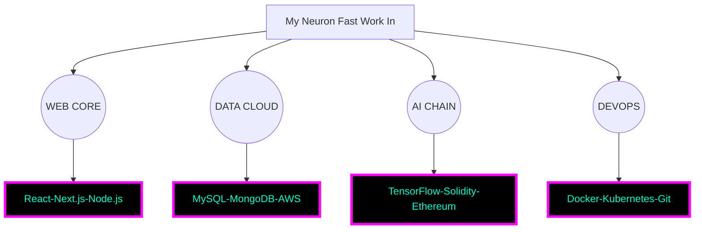

  
    
     
  
  <h1 style="color:#00ffcc; text-shadow: 0 0 60px #ff00ff, 0 0 120px #00ffcc; font-family: 'Orbitron', sans-serif; font-size: 60px; animation: neonflicker 0.6s infinite; letter-spacing: 4px;">D H I R A J • L O C H I B</h1>  
  
>_ ᴡᴇʟᴄᴏᴍᴇ ᴛᴏ ᴍʏ ɴᴇᴏɴ ʜᴇʟʟsᴄᴀᴘᴇ, ʏᴏᴜ ᴅᴀᴛᴀ-ᴅʀᴏᴡɴɪɴɢ ᴄʏʙᴇʀ-ʀᴀᴛ
  

  
    
    
     
    
      
    
    

---

## `> Tᴇᴄʜ. Stack`

  
  <table style="width: 100%; border-collapse: collapse; table-layout: fixed;">  
    <tr>  
      <td align="center" style="background:#000; padding: 45px; border: 10px solid #ff00ff; box-shadow: 0 0 35px #00ffcc;">  
        <strong>FRONTEND</strong>   
        
Your interface bows to my radiant design
  
          
      </td>  
      <td align="center" style="background:#000; padding: 45px; border: 10px solid #ff00ff; box-shadow: 0 0 35px #00ffcc;">  
        <strong>BACKEND</strong>   
        
I guide your systems to a brighter digital path
  
          
      </td>  
    </tr>  
    <tr>  
      <td align="center" style="background:#000; padding: 45px; border: 10px solid #ff00ff; box-shadow: 0 0 35px #00ffcc;">  
        <strong>DATABASE</strong>   
        
Storing more then my 8Bit Dreams
  
          
      </td>  
      <td align="center" style="background:#000; padding: 45px; border: 10px solid #ff00ff; box-shadow: 0 0 35px #00ffcc;">  
        <strong>CLOUD</strong>   
        
I bring a cascade of innovation to your skies
  
          
      </td>  
    </tr>  
    <tr>  
      <td align="center" style="background:#000; padding: 45px; border: 10px solid #ff00ff; box-shadow: 0 0 35px #00ffcc;">  
        <strong>BLOCKCHAIN</strong>   
        
Your transactions glow within my secure network
  
          
      </td>  
      <td align="center" style="background:#000; padding: 45px; border: 10px solid #ff00ff; box-shadow: 0 0 35px #00ffcc;">  
        <strong>AI/ML</strong>   
        
My intelligence elevates your thoughts to new heights
  
          
      </td>  
    </tr>  
  </table>  

---

## `> MY ɴᴇᴜʀᴏ ᴄɪʀᴄᴜɪᴛ`

---

## `> I Can Talk In`

  

    
    
    
    
  

  

---

## `> Stats`

  
    
    
     
    
     
    
     
    

---
## You're at the end  
- Dhiraj Lochib
